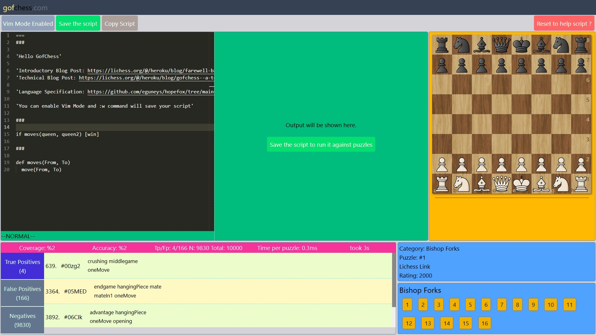

# [gofchess.com](https://gofchess.com)

GofChess (g of f of Chess) is a Chess Tactics Language. gofchess.com is the platform to experiment with it.

GofChess is written in [Typescript](https://www.typescriptlang.org/) and relies on the [SolidJS library](https://www.solidjs.com/).

Currently there is no backend everything is run in an Offline-First Single Page Application.

Use [Github issues](https://github.com/eguneys/gofchess-26/issues) for bug reports and feature requests.

## License

GofChess is licensed under the MIT License.

## Credits

This project wouldn't be possible without the Lichess.org ecosystem.